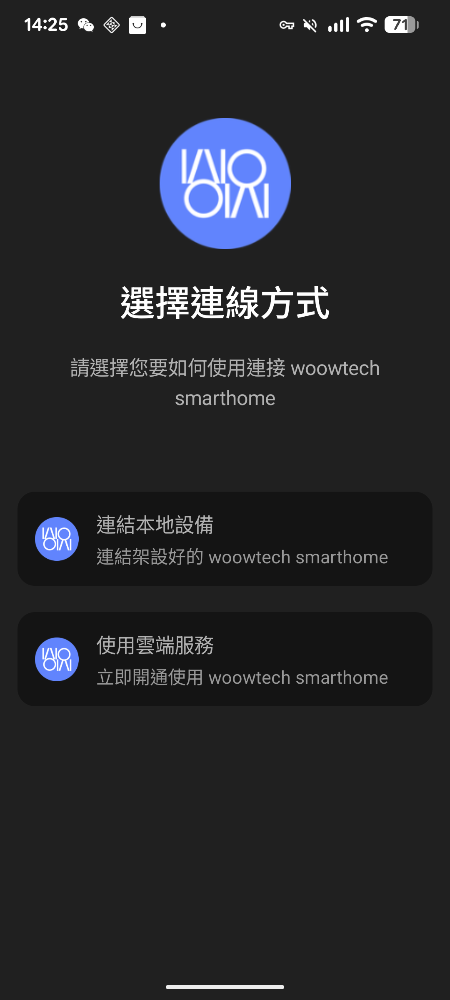
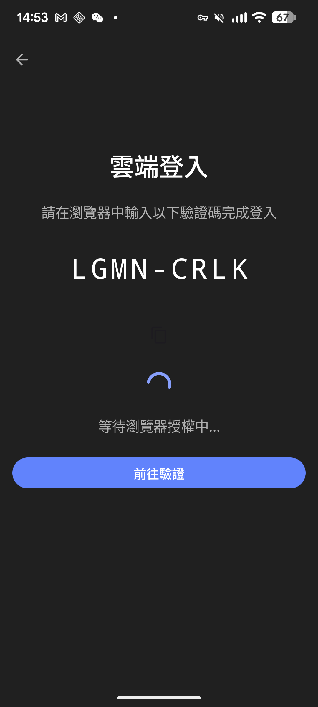

# Cloud Onboarding Integration Test — 2026-08-19

**Status**: ✅ End-to-end path (Eugene stack → PaaS device flow → user_code issued) verified on real device (Pixel 7a / Android 16). Ready to merge to `main` once permanent fixes below are applied.

**Branch**: [`dev/cloud-onboarding-integrated`](../../tree/dev/cloud-onboarding-integrated)
**Base**: `main@fa397e1` + Eugene stack (PR [#4](../../pull/4)+[#5](../../pull/5)+[#6](../../pull/6)+[#7](../../pull/7), 13 commits) + 3 workaround commits documented below.
**Test device**: Pixel 7a, Android 16, package `com.woowtech.homecloud.debug`, version `2027.0.0-beta.1+integrated-full`.

---

## TL;DR

| # | 問題 | 根因 | 這次的處置 | **永久修法** |
|---|---|---|---|---|
| 1 | `dev-build.yml` 每次 push 都炸在 `git fetch origin releases` | `releases` branch 從沒被建立 | 拿掉那 8 行、只留 `actions/upload-artifact` | 決定政策：真的要 releases branch → 建它；不要 → 保留這次修法 |
| 2 | Reckon plugin 阻擋 build：`Reckoned version 0.0.1 < base 2026.8.3-cloud-alpha1` | Tag `v2026.8.3-cloud-alpha1` 的 pre-release suffix `cloud-alpha1` 不符 reckon stage 格式（`beta.N` / `final`），reckon 從 0.0.0 起算永遠低於 base tag | 整合 branch 上 bypass reckon plugin、hardcode `version = "2027.0.0-beta.1+integrated"` | 二選一：<br>(a) 把 tag 改成 semver-parseable `v2026.8.3-beta.1`（並更新 Release）<br>(b) `settings.gradle.kts` 加 `cloud-alpha` 到 `stages(...)` 白名單並驗證 reckon 能 parse `2026.8.3-cloud-alpha.1`（注意需加 `.`）|
| 3 | 上機測試時 debug build 打 `stg.woowtech.io` → 「伺服器回應格式錯誤」 | STG 掛在 Cloudflare Access 後面，plain HTTP client 沒 CF Access cookie/service token → 302 到 CF login 頁 → 拿到 HTML 而非 JSON → kotlinx.serialization throw | 用 Cloudflare API 把手機出口 IP `118.169.84.175/32` 加進 `prod-ip-bypass` policy | 二選一：<br>(a) 給 debug build 塞 CF Service Token（`CF-Access-Client-Id` / `CF-Access-Client-Secret` header）<br>(b) 把 debug flavor 拆成 `debug-stg` / `debug-prod`，dev-build 預設走 `debug-prod` |

三個問題**都與 Eugene 的 stack 內容無關**——都是外圍環境設定問題。Stack 本身經實測驗證：APK build 成功、無 crash、CloudChooser 正確、CloudSignIn 正確拿到 user_code。

---

## 一、時間軸（此次整合實測）

| 時間 (UTC+8) | 事件 |
|---|---|
| 2026-08-19 13:12 | 從 `main@fa397e1` 建 `dev/cloud-onboarding-integrated`；fast-forward merge `eugene/feature/cloud-ui-tests`（PR #7 含 #4+#5+#6 全 stack 13 commits） |
| 13:15 | 修 `dev-build.yml`（removes releases branch push），push → CI 第 1 輪 |
| 13:22 | CI 第 1 輪失敗：reckon `0.0.1-beta.0.3175 < 2026.8.3-cloud-alpha1` |
| 13:24 | 嘗試 `-Preckon.stage=beta -Preckon.scope=minor`，CI 第 2 輪失敗（`setScopeCalc { PATCH }` hardcode override 掉了 -P flag） |
| 13:27 | 改 `settings.gradle.kts` 讓 `setScopeCalc { MAJOR }`，CI 第 3 輪失敗（reckon 從 0.0.0 起算 → 1.0.0-beta.1 仍 < base） |
| 13:31 | 完全 bypass reckon plugin，hardcode `version = "2027.0.0-beta.1+integrated"`，CI 第 4 輪 **成功**（9m50s） |
| 13:45 | APK 42MB 上傳 artifact，用 aapt 比對 alpha1（68MB）→ 確認尺寸差 24.8MB 全數為 `libcronet.so`（alpha1 是 minimalDebug bundle cronet、本次是 fullDebug 走 GMS 動態 cronet） |
| 14:22 | adb wireless 連 Pixel 7a（配對 39589+194588、connect 38927），install APK 成功 |
| 14:25 | 手機上點「使用雲端服務」→「伺服器回應格式錯誤」 |
| 14:33 | curl 診斷：STG 回 CF Access 302 HTML；PROD 回正常 JSON |
| 14:40 | Eugene 決定 STG 是對的、由他 CF 側加 IP allowlist |
| 14:48 | 從手機的 Chrome 打 `api.ipify.org` 抓出手機出口 IP：`118.169.84.175` |
| 14:52 | 用 Cloudflare MCP `PUT /accounts/{acct}/access/policies/324f5955-...` 把 `118.169.84.175/32` 加進 `prod-ip-bypass` policy（11 → 12 IP） |
| 14:53 | 重按「使用雲端服務」→ **成功進 CloudSignIn 畫面拿到 `user_code: LGMN-CRLK`** |

Total: ~2 小時，含 4 輪 CI build（reckon 試錯 3 次）+ 環境調校（CF Access IP）+ 診斷。

---

## 二、`dev/cloud-onboarding-integrated` 分支結構

```
main@fa397e1 (v2026.8.3-cloud-alpha1)
  │
  ├── (Eugene stack, 13 commits, fast-forward merge from eugene/feature/cloud-ui-tests)
  │   │  10e8172 feat: WoowPaasConfig 改用 buildConfigField 切換 stg/prod
  │   │  9af4f0d fix: prod WOOW_PAAS_BASE_URL 移除 /woow 前綴
  │   │  b2ac86d refactor(cloud): WoowPaasApi → Retrofit + kotlinx.serialization + Repository
  │   │  72c1692 refactor(cloud): WoowPaas 綁定改用 :common 的 Hilt @Binds
  │   │  73dced1 test(cloud): getStatus 補上與其他端點對稱的兩個測試
  │   │  e1b4496 refactor(cloud): 移除 WoowPaasConfig 已無呼叫者的 resolveUrl/joinUrl 死碼
  │   │  0313781 feat(cloud): paas token 持久化與 401 自動 refresh
  │   │  c57ffb9 feat(cloud): 伺服器加入 app 後清除 paas token
  │   │  66b8b56 fix(cloud): 收斂 refresh 輪替的取消視窗與 session 比對
  │   │  cc0b85e fix(cloud): 修正 cloud onboarding 的返回鍵死路
  │   │  c85c85e test(cloud): 補齊 cloud 三畫面 UI/navigation/screenshot 測試
  │   │  d65ca18 test(cloud): 更新 CloudSignInNavigationTest 以反映 T3 後真實的返回導覽
  │   └  63644a0 fix(cloud): 修正 rebase 後 DeviceFlowUiState.Authorized 建構子呼叫不相容
  │
  └── (Integration workarounds, 3 commits — NOT for main)
      │  ad16dae ci(dev-build): drop broken releases-branch push
      │  476d340 chore(reckon): bypass reckon entirely on integration branch
      └  d8114e3 Revert prod-URL change (kept debug=stg per product decision)
```

⚠️ 合 main 時**只合 Eugene 的 13 commits**，`ad16dae` / `476d340` / `d8114e3` 是 workaround 不合。

---

## 三、驗證通過的實測畫面

### 3.1 CloudChooser（入口）


顯示「選擇連線方式」與兩張卡片「連結本地設備 / 使用雲端服務」，文案與 Elmo 08-12 `polish(cloudchooser)` 一致。**代表 Eugene stack + rebrand + strictmode fix 全部在 fullDebug APK 內正確作用**。

### 3.2 CloudSignIn（OAuth device flow issued）


- User code: **`LGMN-CRLK`**（由 `stg.woowtech.io/oauth2/device_authorization` 回傳）
- 狀態：「等待瀏覽器授權中…」（app 正在 poll `/oauth2/token`）
- 「前往驗證」按鈕（會以 `verification_uri_complete` 開系統瀏覽器）

**代表這幾件事同時成立**：
1. Retrofit + kotlinx.serialization 重構（PR #5）能對真實 stg 端點 encode/decode 成功
2. `WoowPaasConfig` buildConfigField（PR #4）注入的 `WOOW_PAAS_BASE_URL_DEBUG = stg.woowtech.io` 正確被讀出
3. Cloudflare Access allowlist 讓手機出口 IP 過關（`118.169.84.175/32`）
4. `CloudSignInViewModel` 的 device flow poll 循環（PR #1 修好的 transient retry）正常運作
5. UI hoisting（PR #7 為 screenshot test 抽出的 `CloudSignInContent`）在 runtime 正常渲染

---

## 四、每個 Workaround Commit 的細節與永久修法

### 4.1 `ad16dae` — dev-build.yml removes releases-branch push

**症狀**：`dev-build.yml` 每次 push 都失敗在 `git fetch origin releases` → `fatal: couldn't find remote ref releases`。歷史上唯一一次執行（2026-08-12）就是這樣掛的。

**根因**：workflow 假設有一個 `releases` branch 收集 APK，但那個 branch 從沒建。整個 job 順序：build APK → rename → **push to releases branch (炸)** → upload artifact。前面兩步做完了，因為第 3 步炸掉、artifact upload 永遠不會執行。

**這次做**：把「push to releases branch」那 12 行整段拿掉，`actions/upload-artifact` 保留。

**永久修法**（三選一，看產品決定）：
1. 在 repo 建 empty `releases` branch，恢復 workflow 原設計
2. 保留這次修法，改到 GitHub Releases（用 `softprops/action-gh-release`）
3. 保留這次修法，只用 artifact（reviewer 直接從 run 頁面下載，30 天後過期）

---

### 4.2 `476d340` — bypass reckon plugin

**症狀**：
```
Reckoned version 0.0.1-beta.0.3175+ad16dae is (and cannot be) less
than base version 2026.8.3-cloud-alpha1
```

**根因**：`settings.gradle.kts` 用 reckon plugin 從 git tag 自動 reckoning 版本號。CI 走 `stages("beta", "final")` 白名單。Repo 上唯一的 base tag 是 `v2026.8.3-cloud-alpha1`（[官方 alpha1 Release 掛在 `fa397e1`](../../releases/tag/v2026.8.3-cloud-alpha1)，帶 68MB APK asset）。

- 這個 tag 的 pre-release 段 `cloud-alpha1` 不在 stage 白名單也不是 semver `stage.num` 格式
- reckon 認得這個 tag 為 base（用來檢查 reckoned 不能 < base），但 parse 不出來當作「先前 release」→ **從 0.0.0 起算**
- 隨便怎麼加 scope（PATCH → 0.0.1；MAJOR → 1.0.0）都 < 2026.8.3
- `setScopeCalc { Optional.of(Scope.PATCH) }` 又是 hardcode，`-Preckon.scope=minor` command line flag 被無視

**這次做**：把整個 `if (!isWorktree) { apply(reckon); reckon { ... } }` 區塊改成 `gradle.beforeProject { version = "2027.0.0-beta.1+integrated" }`。

**永久修法**（二選一）：
1. **改 tag 命名**：把 `v2026.8.3-cloud-alpha1` 改成 `v2026.8.3-beta.1`（semver 合規），同時更新 Release 標題和 tag_name。副作用：release URL 會變（原 `.../releases/tag/v2026.8.3-cloud-alpha1` → `.../releases/tag/v2026.8.3-beta.1`）。
2. **加 stage 白名單**：`stages("beta", "cloud-alpha", "final")` — 但要驗證 reckon 能 parse `cloud-alpha1` 為 stage=cloud-alpha,num=1（可能需要改成 `cloud-alpha.1` 才行）。

方案 1 更乾淨。方案 2 較保守但需要實測 reckon 版本行為。

---

### 4.3 `d8114e3` — Revert prod-URL change

暫時把 debug URL 從 stg 指到 prod 的實驗（`59f126d`），Eugene 決定「debug=stg 是對的、由 CF 側加 IP」後 revert。這個 commit **不是 workaround，是紀錄還原**。合 main 時可保留（是個 no-op revert），也可跟 `59f126d` 一起 drop。

---

## 五、Cloudflare Access 側的處置紀錄

**Policy**: `prod-ip-bypass` (`324f5955-2c08-420b-b4a8-b882fa82320d`) — reusable，被 7 個 app 引用，其中 `sandbox-stg` = `stg.woowtech.io` 就是這次要過的。

**變更**：
- Before: 11 個 IP（10 v4 + 1 v6）
- After: 12 個 IP，新增 `118.169.84.175/32`（Pixel 7a 測試機的出口 IP，Elmo 家 WiFi）
- Method: Cloudflare API `PUT /accounts/{acct}/access/policies/{policy_id}` via MCP
- Audit: CF `updated_at` = 2026-08-19T06:52:41Z

**建議永久解**：這個 policy 是 IP allowlist，加測試人員 WiFi IP 會越加越亂。長遠應該：
1. **Service Token**：CF Access Service Token → app 帶 `CF-Access-Client-Id` / `CF-Access-Client-Secret` header 就能過（不看 IP）
2. **WARP-only**：所有測試機裝 Cloudflare WARP → 用 WARP identity 判斷
3. **debug-stg vs debug-prod flavor split**：讓一般人拿到的 debug APK 打 prod、只有內部測試機用 debug-stg flavor 打 stg

---

## 六、APK 與 Alpha1 對比（大小疑問的答案）

用 `unzip -l` 拆兩顆 APK 逐條比對：

| Section | Integrated (fullDebug) | Alpha1 (minimalDebug) | 差 |
|---|---|---|---|
| DEX (24 files) | 107.8 MB | 104.1 MB | +3.7 MB（Eugene 新加的 Retrofit + kotlinx.serialization + 107 個測試相關 code） |
| `lib/*/libcronet.so` (4 ABI) | **0 MB**（用 GMS 動態 cronet）| 24.8 MB（bundle） | **-24.8 MB** |
| Firebase / Play Services `.properties` | 15 files | 0 | +小 |
| **APK on disk** | **47.7 MB** | 68 MB | -20 MB |

同 flavor 對比：base `woow_ha_app` 的 fullDebug（v1.2–1.7）都是 45 MB，我們 47.7 MB = +2.7 MB，符合 Eugene stack 增量。

**沒有東西被裁掉**。差異來自 flavor（minimal vs full）而非 stack。

---

## 七、給下游 reviewer 的建議

### Eugene 的 4 個 PR（[#4](../../pull/4)/[#5](../../pull/5)/[#6](../../pull/6)/[#7](../../pull/7)）合入 main 的順序

Stack 綁死，順序不可改：**#4 → #5 → #6 → #7**。中間任一被拒都會炸掉後面。

### 合 main 之前要先做的

1. **修 `v2026.8.3-cloud-alpha1` tag 或 reckon config**（見 4.2 永久修法）——不修的話 Eugene stack 進 main 之後 pr.yml 的 `pr_build` job 會遇到跟我們一樣的 reckon 錯誤。
2. **修 `dev-build.yml` releases branch 政策**（見 4.1）——這次我們拿掉 push 步驟；main 上要決定用哪一種。
3. **決定 stg 的可及性方案**（見 5 永久解）——這次 IP allowlist 只對 Elmo 家 WiFi 有效，換個測試環境就得再加。

### `pr.yml` CI 上還有幾條紅（跟這次 stack 無關但要 ack）

- `Screenshot Tests`：4 張 `HAAccentButton` / `HASwitch` golden 差 1px（跟 alpha1 release note 提到的「4 screenshot tests baselines predate the Primary40→Primary50 loud-button rebind」是同一批）
- `Unit Tests`：需個別看 log 判斷是真 fail 還是同 flake
- `Publish Tests Results` 因為 downstream 失敗才 fail

建議 merge 前跑一次 `updateScreenshot.yml`（官方 workflow 專門處理 host renderer 差異）重新產 golden。

---

## 八、`dev/cloud-onboarding-integrated` 這條 branch 之後怎麼處理

- 若 4 PR 合 main 成功：整合 branch 可以刪（`git push origin --delete dev/cloud-onboarding-integrated`）
- 若某個 PR 被卡：整合 branch 保留當 reference，Eugene 改 PR 後我們可以 rebase 再產一次 APK

---

## 九、附錄：這條實測用到的 APK

- **URL**: https://github.com/WOOWTECH/woow_ha_app_cloud_vesion/actions/runs/32219930928
- **Artifact**: `debug-apk` (`woowtech-home-dev-cloud-onboarding-integrated-debug.apk`, 47.7 MB)
- **VersionName**: `2027.0.0-beta.1+integrated-full`
- **Package**: `com.woowtech.homecloud.debug` (與 alpha1 minimal 版 `com.woowtech.homecloud.minimal.debug` 可同機共存)
- **有效期**: 2026-11-17（GitHub artifact 90 天）

Report author: Claude Opus 4.7 (1M context), assisted by @eugenechen0514 (STG CF policy management) and @toypark1234 (Elmo, integration branch owner).
